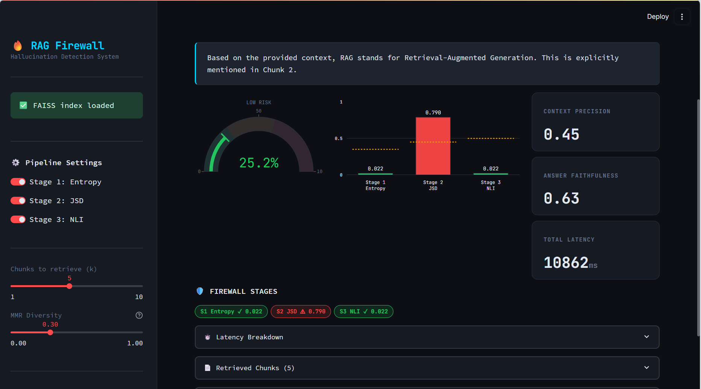
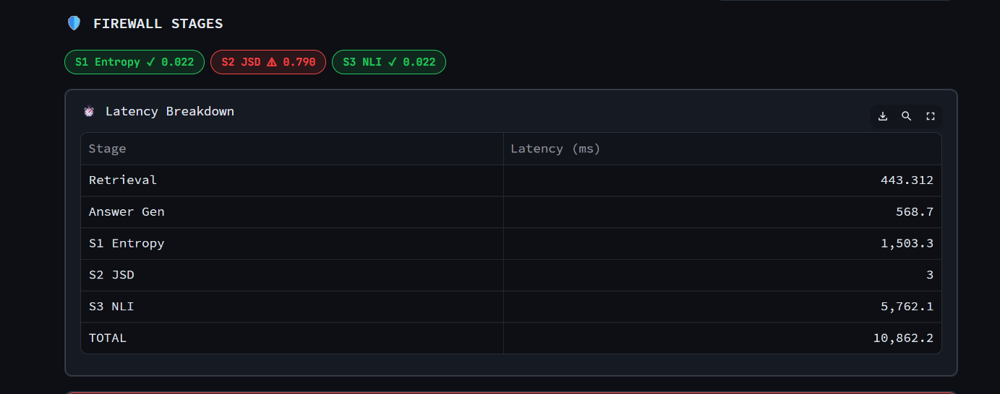
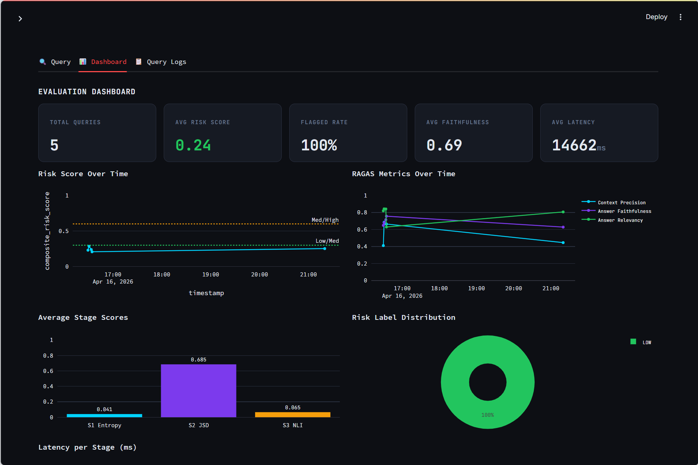
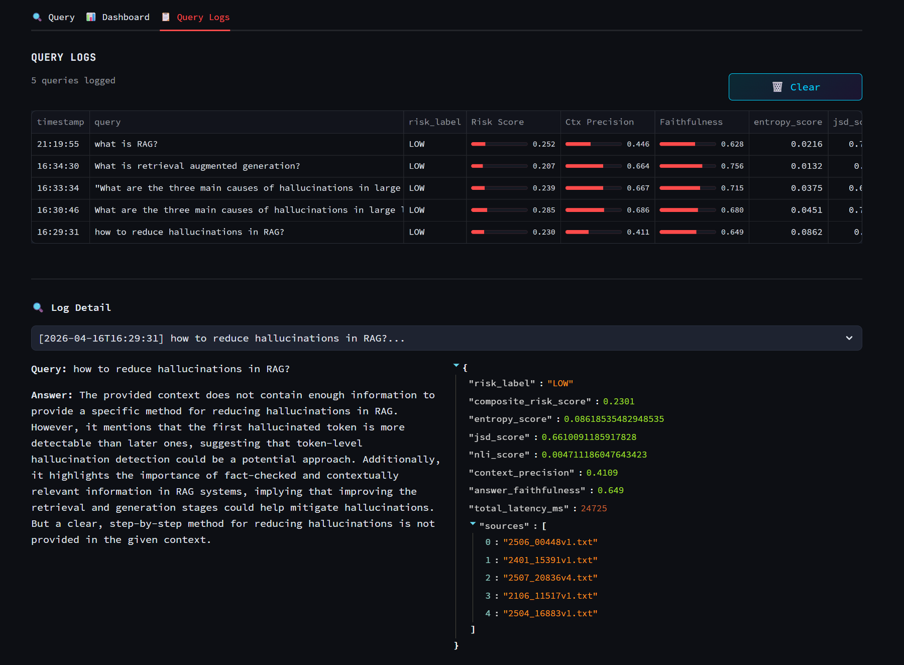

# 🔥 RAG Hallucination Firewall

A RAG middleware with a **three-stage hallucination detection pipeline**, built with LangChain, FAISS, and Groq. Features a real-time Streamlit evaluation dashboard tracking GenAI quality metrics.

[](https://www.python.org/)
[](https://github.com/langchain-ai/langchain)
[](https://github.com/facebookresearch/faiss)
[](https://streamlit.io/)
[-purple)](https://console.groq.com)
[](https://docs.docker.com/compose/)
[](k8s/)
[](https://kafka.apache.org/)
[](LICENSE)

---

## 🎬 Demo

[](assets/demo.gif)

[](https://youtu.be/tsqRcIyXGTw)

*Click to watch the full pipeline demo — live query, risk gauge, three-stage firewall, and evaluation dashboard*

---

## 🖼️ Screenshots

| **Query Interface — Live Result** | **Firewall Stages — PASS/FLAG Badges** |
|---|---|
|  |  |
| **Evaluation Dashboard** | **Query Logs** |
|  |  |

---

## 📊 Evaluation Results

Evaluated across **20 questions** spanning 4 categories on a 198-paper arXiv AI/ML corpus (abstracts only).

> ⚠️ **Sample size caveat**: n=20 means all percentages carry a 95% confidence interval of approximately ±22 percentage points (Wilson score interval). These results are directional indicators, not statistically definitive benchmarks. Ground-truth labels are heuristic (keyword matching + hedge-phrase detection), not human-verified.

### Retrieval & Quality

| Metric | Result | Notes |
|---|---|---|
| **Retrieval Latency** | **162ms** avg | Target: <200ms ✅ |
| **Context Precision** | **0.414** avg | Limited by abstract-only corpus; full-paper ingestion would improve this |
| **Answer Faithfulness** | **0.563** avg | Cosine similarity proxy, not semantic entailment |
| **Answer Relevancy** | **0.825** avg | |

### Per-Stage Firewall Analysis

The key insight from ablation: the three stages are not equally useful.

| Stage | False Positive Rate (in-scope) | "True Positive" Rate (risky queries) | Notes |
|---|---|---|---|
| S1 Semantic Entropy | Low | Moderate | Reliable uncertainty signal |
| S2 JSD | **Very high** | High | ⚠ See JSD section below |
| S3 NLI (DeBERTa) | Low | Moderate | Strongest semantic signal |
| Composite | Low | High | Reweighted: NLI 45%, Entropy 35%, JSD 20% |

> **Why JSD has a high false positive rate**: JSD measures token-frequency divergence between context (long, multi-chunk) and answer (short, paraphrased). Natural language answers routinely produce JSD 0.60–0.95 vs. their source context simply because answers are shorter and use different surface forms. The threshold was recalibrated from 0.45 → 0.80 to match empirical baselines; JSD weight was reduced from 30% → 20% in the composite. See `config/settings.py` for full calibration notes.

---

## 🏗️ Architecture

```
User Query
    │
    ▼
┌──────────────────────────────────────────────────────┐
│  RETRIEVAL PIPELINE                                  │
│  RecursiveCharacterTextSplitter (512 chars, 50 overlap)
│  all-MiniLM-L6-v2 embeddings (384-dim, local)        │
│  FAISS IndexFlatIP + MMR (λ=0.3) — sub-200ms         │
│                                                      │
│  Note: IndexFlatIP = exact search, O(n). Scales to   │
│  ~10K chunks; use IndexIVFFlat for larger corpora.   │
└──────────────────────────┬───────────────────────────┘
                           │  Top-K Chunks (MMR)
                           ▼
┌──────────────────────────────────────────────────────┐
│  LLM GENERATION                                      │
│  Groq API · llama-3.3-70b-versatile · temp=0.0       │
└──────────────────────────┬───────────────────────────┘
                           │  Deterministic Answer
                           ▼
┌──────────────────────────────────────────────────────┐
│  THREE-STAGE HALLUCINATION FIREWALL                  │
│                                                      │
│  Stage 1 ── Semantic Entropy                         │
│             5 LLM samples at temp=0.7                │
│             mean pairwise cosine distance            │
│             threshold: 0.35                          │
│             Note: simplified vs. Farquhar et al.     │
│             (uses raw embedding distance, not        │
│              semantic equivalence classes)           │
│                                                      │
│  Stage 2 ── Jensen-Shannon Divergence                │
│             token frequency distributions            │
│             context vs answer vocabulary             │
│             threshold: 0.80 (recalibrated)           │
│             ⚠ Bag-of-words; high FP for paraphrase  │
│             Best used as extreme-OOV detector        │
│                                                      │
│  Stage 3 ── DeBERTa NLI Cross-Check                  │
│             cross-encoder/nli-deberta-v3-small       │
│             max contradiction prob across chunks     │
│             threshold: 0.50                          │
│             Strongest signal; semantic-level check   │
│                                                      │
│  composite = 0.35·S1 + 0.20·S2 + 0.45·S3            │
│  (reweighted: NLI upweighted; JSD downweighted)      │
└──────────────────────────┬───────────────────────────┘
                           │
                           ▼
       🟢 LOW (0–0.3) · 🟡 MEDIUM (0.3–0.6) · 🔴 HIGH (0.6–1.0)
            + Streamlit Dashboard · Query Logs · RAGAS Metrics
```

---

## ✨ Key Features

| Feature | Detail |
|---|---|
| **Chunking** | `RecursiveCharacterTextSplitter` (512 chars, 50 overlap) |
| **Embeddings** | `sentence-transformers/all-MiniLM-L6-v2` — local, free, L2-normalized 384-dim |
| **Vector Store** | FAISS `IndexFlatIP` + MMR retrieval (4× candidate fetch, λ=0.3) |
| **LLM** | Groq API — `llama-3.3-70b-versatile` (free tier) |
| **Stage 1** | Semantic entropy: mean pairwise cosine distance across N=5 stochastic samples |
| **Stage 2** | Jensen-Shannon divergence (bag-of-words; see limitations) |
| **Stage 3** | `cross-encoder/nli-deberta-v3-small` NLI — max contradiction prob across chunks |
| **Composite Score** | Weighted: **45% NLI + 35% Entropy + 20% JSD** |
| **Dashboard** | 3-tab Streamlit: Query, Dashboard (6 charts), Query Logs |
| **Evaluation** | Per-stage ablation, Wilson CIs, honest caveats |
| **Tests** | 37 unit tests, 100% passing |
| **Zero Cost** | All models run locally; only Groq API call is external (free tier) |

---

## 🚀 Quick Start

### Prerequisites

- Python 3.10+ (Anaconda recommended on Windows)
- Free Groq API key from [console.groq.com](https://console.groq.com) — no credit card needed

### 1. Clone & Install

```bash
git clone https://github.com/swathi-2406/rag-hallucination-firewall.git
cd rag-hallucination-firewall
```

**Windows (Anaconda — recommended):**
```bash
conda activate base
pip install torch --index-url https://download.pytorch.org/whl/cpu
pip install langchain langchain-community langchain-groq langchain-text-splitters langchain-core langchain-huggingface faiss-cpu sentence-transformers transformers scipy numpy ragas datasets arxiv pypdf streamlit plotly pandas python-dotenv pydantic tenacity tqdm
```

**Mac/Linux:**
```bash
pip install -r requirements.txt
```

### 2. Configure Environment

```bash
copy .env.example .env      # Windows
cp .env.example .env        # Mac/Linux
# Edit .env and add your GROQ_API_KEY
```

### 3. Ingest Documents

```bash
python scripts/ingest_docs.py
```

Downloads ~200 AI/ML paper abstracts from arXiv and builds the FAISS index.
Takes 3–5 minutes on first run (downloads embedding model ~90MB, cached after).

### 4. Run the App

```bash
streamlit run app.py
```

Open http://localhost:8501

### 5. (Optional) Run Automated Evaluation

```bash
python scripts/evaluate_firewall.py
```

Runs 20 questions with per-stage ablation analysis. Takes ~20 minutes. Results in `data/evaluation/`.

---

## 📁 Project Structure

```
rag-hallucination-firewall/
├── app.py
├── requirements.txt
├── .env.example
├── Dockerfile
├── docker-compose.yml            # app + Kafka + monitoring consumer
├── k8s/                          # Kubernetes manifests (namespace → app)
│   ├── 00-namespace.yaml
│   ├── 01-configmap.yaml
│   ├── 02-secret.example.yaml
│   ├── 03-data-pvc.yaml
│   ├── 10-kafka.yaml
│   ├── 20-app.yaml
│   └── 21-kafka-consumer.yaml
├── config/
│   └── settings.py              # All parameters with calibration notes
├── src/
│   ├── retrieval/
│   │   ├── chunker.py
│   │   ├── embedder.py
│   │   └── retriever.py
│   ├── hallucination/
│   │   ├── firewall.py          # Orchestrates all 3 stages
│   │   ├── stage1_entropy.py    # Semantic entropy scoring
│   │   ├── stage2_jsd.py        # JSD (with limitations documented)
│   │   └── stage3_nli.py        # DeBERTa NLI cross-check
│   ├── evaluation/
│   │   ├── metrics.py
│   │   └── logger.py            # writes JSONL + publishes to Kafka
│   └── streaming/
│       └── kafka_producer.py    # best-effort event publisher
├── scripts/
│   ├── ingest_docs.py
│   ├── evaluate_firewall.py     # Per-stage ablation + honest caveats
│   └── kafka_consumer.py        # standalone monitoring service
└── tests/
```

---

## 💡 How the Hallucination Firewall Works

### Stage 1 — Semantic Entropy

Samples N=5 outputs from the LLM at temperature=0.7. Embeds each using the same sentence-transformer. Computes mean pairwise cosine distance:

```
entropy = mean({ 1 - cos_sim(e_i, e_j) | i < j })
```

Near 0 = model is consistent → low risk. Near 1 = outputs diverge → high uncertainty.

**Implementation note**: This is a simplified approximation of [Farquhar et al. (2023)](https://arxiv.org/abs/2302.09664). The original paper clusters outputs into semantic equivalence classes before computing entropy; this implementation uses raw embedding distance, which is computationally simpler but may conflate surface-form variation with semantic uncertainty.

### Stage 2 — Jensen-Shannon Divergence

Computes JSD between token frequency distributions of context and answer:

```
JSD(P||Q) = ½·KL(P||M) + ½·KL(Q||M),   M = ½(P+Q)
```

**⚠ Important limitation**: JSD is a bag-of-words measure. In practice, answers naturally score JSD 0.60–0.95 vs. their source context because:
- Answers are shorter and more focused than multi-chunk context passages
- Answers paraphrase; they don't copy exact wording
- Technical synonyms count as distinct tokens

The threshold is set at 0.80 (empirically calibrated on this corpus's in-scope vs. out-of-scope JSD distributions). At this threshold, Stage 2 functions as an extreme out-of-vocabulary detector — flagging answers that share almost no vocabulary with the context — not a subtle grounding checker.

For stronger token-level grounding analysis, consider replacing JSD with [BERTScore](https://github.com/Tiiiger/bert_score), which maps tokens to embedding space before comparing.

### Stage 3 — NLI Cross-Check

Runs `cross-encoder/nli-deberta-v3-small` (~85MB, runs locally) on each (context chunk, answer) pair. Takes the **maximum** contradiction probability:

```
Stage3_score = max(P(CONTRADICTION | chunk_i, answer))
```

This is the strongest and most semantically precise stage. It catches answers that are fluent and confident but directly contradict retrieved evidence, regardless of surface-level vocabulary differences.

### Composite Risk Score

```
risk = 0.35 × entropy + 0.20 × JSD + 0.45 × NLI
```

Weight rationale: NLI carries the most semantic precision and lowest false positive rate. JSD is downweighted due to high false positive rate from paraphrase behavior. Entropy provides a reliable LLM-uncertainty signal.

| Band | Score | Meaning |
|---|---|---|
| 🟢 LOW | 0.00–0.30 | Answer is grounded and consistent |
| 🟡 MEDIUM | 0.30–0.60 | Uncertainty detected; review recommended |
| 🔴 HIGH | 0.60–1.00 | High hallucination probability |

---

## ⚙️ Configuration

All parameters in `config/settings.py` with calibration notes:

```python
# Stage 1 — Semantic Entropy
ENTROPY_THRESHOLD = 0.35  # Validated: in-scope avg 0.07, out-of-scope avg 0.10

# Stage 2 — JSD
JSD_THRESHOLD = 0.80      # Recalibrated from 0.45; in-scope median 0.73 vs OOS 0.96

# Stage 3 — NLI
NLI_THRESHOLD = 0.50

# Composite weights (must sum to 1.0)
RISK_WEIGHTS = {"entropy": 0.35, "jsd": 0.20, "nli": 0.45}
```

---

## 🧪 Testing

```bash
pytest tests/ -v
```

37 unit tests across 9 test classes, 100% passing.

---

## 🐛 Known Issues & Fixes

### Stage 1 total latency is ~5–8 seconds

Stage 1 makes 5 synchronous Groq API calls sequentially. The 162ms figure in the README refers to retrieval latency only. Total pipeline latency including all 3 stages is approximately 5–10 seconds. **Fix on roadmap**: async parallel entropy sampling.

### Windows — PyTorch won't install from pip

```bash
pip install torch --index-url https://download.pytorch.org/whl/cpu
```

### LangChain 1.x import changes

```python
# Correct (LangChain 1.x)
from langchain_core.documents import Document
from langchain_text_splitters import RecursiveCharacterTextSplitter
```

### FAISS saves as folder not files

FAISS 1.12+ saves as a folder (`faiss_store/`). Check `Path(INDEX_PATH).exists()` not `Path(INDEX_PATH + ".faiss").exists()`.

---

## 🐳 Docker & Kubernetes Deployment

The app, and the optional Kafka event stream described below, can run as containers.

### Docker Compose (app + Kafka + monitoring consumer)

```bash
cp .env.example .env               # add your DEEPSEEK_API_KEY
docker compose build
docker compose run --rm app python scripts/ingest_docs.py   # one-time: build the FAISS index
docker compose up
```

This starts three containers:

| Service | What it does |
|---|---|
| `app` | Streamlit dashboard on http://localhost:8501 |
| `kafka` | Single-broker Kafka (KRaft mode, no Zookeeper) |
| `kafka-consumer` | Standalone monitoring service — see below |

To run the app **without** Kafka (matches the plain `streamlit run app.py` flow), just leave `KAFKA_ENABLED=false` in `.env` and run `docker compose up app` — the `depends_on: kafka` in `docker-compose.yml` only applies when you bring up the full stack.

### Kubernetes

Manifests are in `k8s/`, applied in order:

```bash
docker build -t your-registry/rag-hallucination-firewall:latest .
docker push your-registry/rag-hallucination-firewall:latest
# update the image: field in k8s/20-app.yaml and k8s/21-kafka-consumer.yaml first

kubectl apply -f k8s/00-namespace.yaml
kubectl apply -f k8s/01-configmap.yaml
kubectl create secret generic rag-firewall-secrets -n rag-firewall \
  --from-literal=DEEPSEEK_API_KEY=sk-your-real-key   # see k8s/02-secret.example.yaml
kubectl apply -f k8s/03-data-pvc.yaml
kubectl apply -f k8s/10-kafka.yaml
kubectl apply -f k8s/20-app.yaml
kubectl apply -f k8s/21-kafka-consumer.yaml

kubectl -n rag-firewall port-forward svc/rag-firewall-app 8501:80
```

This deploys the app, a single-node Kafka broker, and the monitoring consumer as separate Deployments — each independently scalable/restartable. The single-node Kafka setup here is sized for a demo, not a production cluster (see comments in `k8s/10-kafka.yaml`); swap in a managed Kafka service or the Strimzi operator for that.

**Ingestion**: the FAISS index isn't rebuilt automatically in the container. Run it once against the shared PVC:
```bash
kubectl -n rag-firewall exec -it deploy/rag-firewall-app -- python scripts/ingest_docs.py
```

## 📡 Kafka Event Streaming

Every query that runs through the firewall already gets logged to `data/query_logs/query_log.jsonl` for the dashboard (`src/evaluation/logger.py`). With `KAFKA_ENABLED=true`, the same event — composite risk score, per-stage scores, risk label, latencies — is also published to a `query-events` Kafka topic, so other services can consume it independently of the Streamlit app:

```
run_firewall() → log_query() ──┬─→ query_log.jsonl  (dashboard reads this)
                                └─→ Kafka "query-events" topic  (any consumer)
```

- **Producer**: `src/streaming/kafka_producer.py`. Fire-and-forget, non-blocking, and a safe no-op when `KAFKA_ENABLED=false` or no broker is reachable — the dashboard never depends on Kafka being up.
- **Consumer**: `scripts/kafka_consumer.py` is one example subscriber — it prints a live line per query (🔴 alerting on HIGH risk) and maintains a rolling aggregate in `data/query_logs/kafka_consumer_stats.json`. A Slack/PagerDuty alerter, a Prometheus exporter, or a separate aggregation job would subscribe to the same topic the same way.

Run it standalone against the compose stack:
```bash
docker compose up -d kafka
docker compose run --rm -e KAFKA_ENABLED=true -e KAFKA_BOOTSTRAP_SERVERS=kafka:29092 \
  app python scripts/kafka_consumer.py
```

## 🗺️ Roadmap

- [ ] **Async parallel entropy sampling** — cut Stage 1 from ~5s to ~1s
- [ ] **Replace JSD with BERTScore** — token-level semantic similarity vs. frequency divergence
- [ ] **Cross-encoder reranking** before firewall (target context precision >0.70)
- [ ] **Full-paper PDF ingestion** for richer retrieval (target faithfulness >0.70)
- [ ] **Larger evaluation set** — target n≥200 with human-verified labels for statistically meaningful results
- [ ] **UMAP embedding space visualization** in dashboard
- [ ] **Answer citation** — map each answer sentence back to its source chunk
- [ ] **FastAPI REST wrapper** for programmatic access
- [x] **Docker container** for reproducible deployment
- [x] **Kafka event streaming** for downstream monitoring/alerting
- [x] **Kubernetes manifests** for multi-service deployment
- [ ] **Multi-broker Kafka / managed Kafka** for production use (current setup is single-node)

---

## 📚 Related Work & Acknowledgements

- [Farquhar et al. (2023)](https://arxiv.org/abs/2302.09664) — Semantic Entropy (Stage 1 inspiration)
- [LangChain](https://github.com/langchain-ai/langchain) — Pipeline orchestration
- [FAISS](https://github.com/facebookresearch/faiss) — Vector search
- [Groq](https://console.groq.com) — Free LLM inference
- [arXiv](https://arxiv.org) — Free research paper corpus
- [RAGAS](https://github.com/explodinggradients/ragas) — Evaluation metric inspiration

---

## 📄 License

MIT
